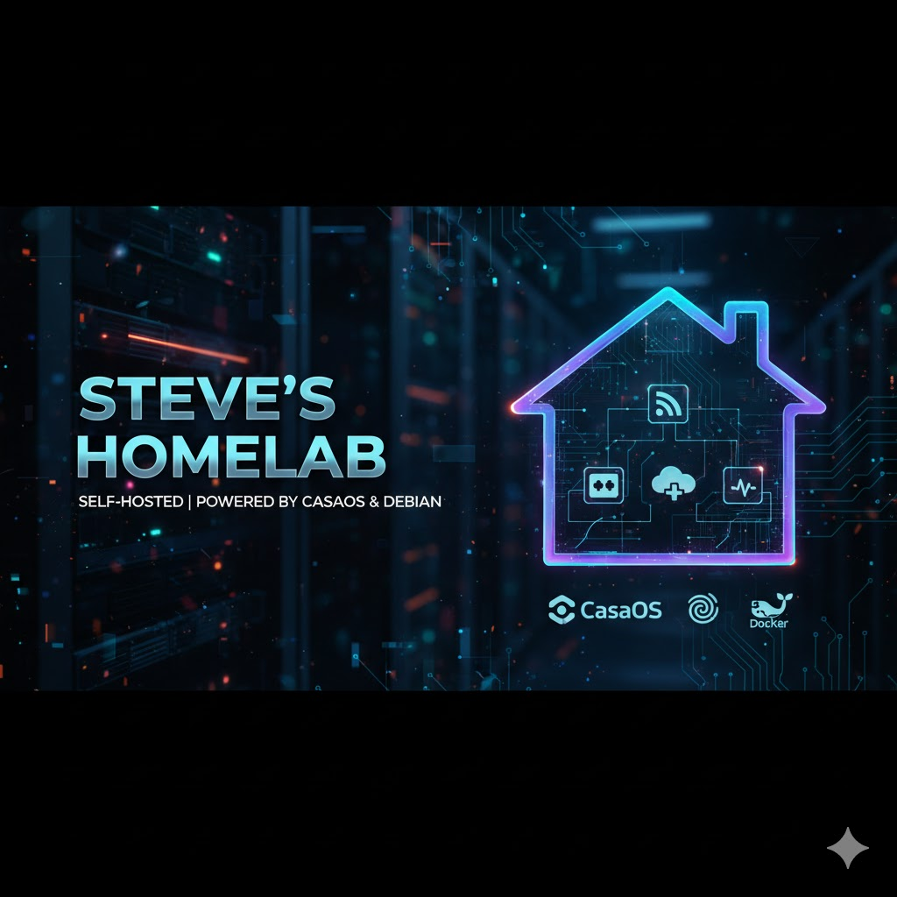

# Steve Homelab 🏠🖥️


## Descripción 📑



Steve Homelab es mi infraestructura de servidor doméstico personal que ejecuta múltiples servicios auto-hospedados utilizando Docker y Docker Compose. Este proyecto incluye una colección de servicios para gestión de medios, productividad, seguridad, monitoreo y más.

El objetivo de este homelab es proporcionar una solución completa y modular para ejecutar servicios de forma privada y segura en un entorno doméstico, con la flexibilidad de añadir o quitar servicios según sea necesario.

## 🚀 Servicios Disponibles

El servidor ejecuta los siguientes servicios:

| Servicio | Puerto Host | Puerto Contenedor | Descripción |
|----------|-------------|-------------------|-------------|
| **Jellyfin** | 8096 | 8096 | Servidor de medios para streaming de películas, series y música |
| **Nextcloud** | 8080 | 80 | Plataforma de almacenamiento en la nube y colaboración |
| **Portainer** | 9000 | 9000 | Interfaz de gestión para Docker |
| **Pi-hole** | 53, 80 | 53, 80 | Bloqueador de anuncios a nivel de red y servidor DNS |
| **Uptime Kuma** | 3001 | 3001 | Herramienta de monitoreo de disponibilidad de servicios |
| **VaultWarden** | 8100 | 80 | Gestor de contraseñas compatible con Bitwarden |
| **N8N** | 5678 | 5678 | Plataforma de automatización de flujos de trabajo |
| **WireGuard Easy** | 51820 | 51820 | VPN segura con interfaz de gestión simple |
| **Netdata** | 19999 | 19999 | Monitoreo en tiempo real del sistema |
| **Cloudflared** | N/A | N/A | Túnel seguro de Cloudflare para acceso remoto |
| **FreshRSS** | 8082 | 80 | Agregador de feeds RSS auto-hospedado |
| **HandBrake** | 5800 | 5800 | Transcodificador de video con interfaz web |
| **MonicaCRM** | 8081 | 80 | Sistema de gestión de relaciones personales |
| **MySpeed** | 5216 | 5216 | Monitor de velocidad de internet |

## 📋 Requisitos Previos

Antes de comenzar, asegúrate de tener instalado:

- **Sistema Operativo**: Linux (Ubuntu Server, Debian, etc.) o cualquier sistema compatible con Docker
- **Docker**: versión 20.10 o superior
- **Docker Compose**: versión 2.0 o superior
- **Git**: para clonar el repositorio
- **Espacio en disco**: Mínimo 50GB recomendado (varía según los servicios que uses)
- **RAM**: Mínimo 4GB recomendado (8GB o más para mejor rendimiento)

### Instalación de Docker y Docker Compose

#### En Ubuntu/Debian:

```bash
# Actualizar paquetes
sudo apt update && sudo apt upgrade -y

# Instalar Docker
curl -fsSL https://get.docker.com -o get-docker.sh
sudo sh get-docker.sh

# Añadir usuario al grupo docker
sudo usermod -aG docker $USER

# Instalar Docker Compose
sudo apt install docker-compose-plugin -y
```

## 🛠️ Instalación y Configuración

### 1. Clonar el repositorio

```bash
git clone https://github.com/SteveMoya/steve-homelab.git
cd steve-homelab
```

### 2. Configurar variables de entorno

Cada servicio puede requerir configuración específica. Crea archivos `.env` en las carpetas de los servicios que lo necesiten:

```bash
# Ejemplo para crear archivo .env
cp projects/Nextcloud/.env.example projects/Nextcloud/.env
# Edita el archivo .env con tus valores
nano projects/Nextcloud/.env
```

### 3. Crear directorios necesarios

```bash
# Los volúmenes de Docker se crearán automáticamente, pero puedes 
# crear directorios específicos si es necesario
mkdir -p ./data ./config ./backups
```

### 4. Iniciar los servicios

Puedes iniciar todos los servicios o servicios individuales:

#### Iniciar todos los servicios:

```bash
docker compose up -d
```

#### Iniciar un servicio específico:

```bash
cd projects/Jellyfin
docker compose up -d
```

### 5. Verificar el estado de los servicios

```bash
docker ps
```

## 📝 Gestión de Servicios

### Detener servicios

```bash
# Detener todos los servicios
docker compose down

# Detener un servicio específico
cd projects/Portainer
docker compose down
```

### Ver logs

```bash
# Ver logs de todos los servicios
docker compose logs -f

# Ver logs de un servicio específico
docker compose logs -f jellyfin
```

### Actualizar servicios

```bash
# Actualizar imágenes
docker compose pull

# Reiniciar con nuevas imágenes
docker compose up -d --force-recreate
```

### Limpiar recursos

```bash
# Eliminar contenedores, redes y volúmenes no utilizados
docker system prune -a
```

## 🔒 Seguridad

### Recomendaciones de Seguridad:

1. **Firewall**: Configura un firewall (UFW, iptables) para controlar el acceso a los puertos
2. **Contraseñas fuertes**: Usa contraseñas únicas y complejas para cada servicio
3. **HTTPS**: Configura certificados SSL/TLS con Let's Encrypt o Cloudflare
4. **Backups**: Realiza copias de seguridad regulares de tus datos
5. **Actualizaciones**: Mantén Docker y tus imágenes actualizadas
6. **VPN**: Usa WireGuard para acceso remoto seguro
7. **Red aislada**: Considera usar redes Docker personalizadas para aislar servicios

### Configurar Firewall (UFW):

```bash
# Habilitar UFW
sudo ufw enable

# Permitir SSH
sudo ufw allow 22/tcp

# Permitir puertos específicos de servicios
sudo ufw allow 8096/tcp  # Jellyfin
sudo ufw allow 9000/tcp  # Portainer
sudo ufw allow 51820/udp # WireGuard

# Ver estado
sudo ufw status
```

## 📦 Estructura del Proyecto

```
steve-homelab/
├── docker-compose.yml          # Archivo principal (si aplica)
├── README.md                   # Este archivo
├── .gitignore                  # Archivos ignorados por Git
└── projects/                   # Carpeta con todos los servicios
    ├── Cloudflared/
    │   ├── docker-compose.yml
    │   └── README.md
    ├── FreshRSS/
    │   ├── docker-compose.yml
    │   └── README.md
    ├── Handbrake/
    │   ├── docker-compose.yml
    │   └── README.md
    ├── Jellyfin/
    │   ├── docker-compose.yml
    │   └── README.md
    ├── MonicaCRM/
    │   ├── docker-compose.yml
    │   └── README.md
    ├── MySpeed/
    │   ├── docker-compose.yml
    │   └── README.md
    ├── N8N/
    │   ├── docker-compose.yml
    │   └── README.md
    ├── Netdata/
    │   ├── docker-compose.yml
    │   └── README.md
    ├── Nextcloud/
    │   ├── docker-compose.yml
    │   └── README.md
    ├── Pi-hole/
    │   ├── docker-compose.yml
    │   └── README.md
    ├── Portainer/
    │   ├── docker-compose.yml
    │   └── README.md
    ├── Uptime-Kuma/
    │   ├── docker-compose.yml
    │   └── README.md
    ├── VaultWarden/
    │   ├── docker-compose.yml
    │   └── README.md
    └── WireGuardEasy/
        ├── docker-compose.yml
        └── README.md
```

## 🔧 Personalización

### Añadir un nuevo servicio:

1. Crea una nueva carpeta en `projects/`
2. Añade un archivo `docker-compose.yml` con la configuración del servicio
3. Documenta el servicio en un `README.md`
4. Actualiza este README principal con la información del nuevo servicio

### Modificar puertos:

Edita los archivos `docker-compose.yml` correspondientes y cambia el mapeo de puertos:

```yaml
ports:
  - "PUERTO_HOST:PUERTO_CONTENEDOR"
```

## 🆘 Solución de Problemas

### El contenedor no inicia:

```bash
# Revisa los logs del contenedor
docker logs nombre_del_contenedor

# Verifica el estado
docker ps -a
```

### Conflicto de puertos:

```bash
# Verifica qué está usando el puerto
sudo lsof -i :8096

# O con netstat
sudo netstat -tulpn | grep :8096
```

### Problemas de permisos:

```bash
# Ajusta permisos de directorios
sudo chown -R $USER:$USER ./data
sudo chmod -R 755 ./data
```

### Reiniciar Docker:

```bash
sudo systemctl restart docker
```

## 🔄 Backups

### Backup de volúmenes Docker:

```bash
# Crear backup de un volumen
docker run --rm -v nombre_volumen:/data -v $(pwd):/backup \
  alpine tar czf /backup/backup-$(date +%Y%m%d).tar.gz /data

# Restaurar backup
docker run --rm -v nombre_volumen:/data -v $(pwd):/backup \
  alpine tar xzf /backup/backup-20231023.tar.gz -C /
```

### Script de backup automático:

Considera configurar un cron job para backups regulares o usar el servicio de backups incluido.

## 🌐 Acceso Remoto

### Con Cloudflare Tunnel:

El servicio Cloudflared proporciona acceso seguro a tus servicios sin exponer puertos. Consulta el README específico en `projects/Cloudflared/`.

### Con WireGuard VPN:

WireGuard Easy permite crear una VPN para acceso seguro desde cualquier lugar. Consulta el README en `projects/WireGuardEasy/`.

## 📚 Documentación Adicional

Cada servicio tiene su propio README con instrucciones específicas:

- [Cloudflared](projects/Cloudflared/README.md)
- [FreshRSS](projects/FreshRSS/README.md)
- [Handbrake](projects/Handbrake/README.md)
- [Jellyfin](projects/Jellyfin/README.md)
- [MonicaCRM](projects/MonicaCRM/README.md)
- [MySpeed](projects/MySpeed/README.md)
- [N8N](projects/N8N/README.md)
- [Netdata](projects/Netdata/README.md)
- [Nextcloud](projects/Nextcloud/README.md)
- [Pi-hole](projects/Pi-hole/README.md)
- [Portainer](projects/Portainer/README.md)
- [Uptime Kuma](projects/Uptime-Kuma/README.md)
- [VaultWarden](projects/VaultWarden/README.md)
- [WireGuard Easy](projects/WireGuardEasy/README.md)

## 🤝 Contribuciones

Las contribuciones son bienvenidas. Si tienes sugerencias de mejoras o encuentras algún problema:

1. Haz un Fork del proyecto
2. Crea una rama para tu feature (`git checkout -b feature/AmazingFeature`)
3. Commit tus cambios (`git commit -m 'Add some AmazingFeature'`)
4. Push a la rama (`git push origin feature/AmazingFeature`)
5. Abre un Pull Request

## 📄 Licencia

Este proyecto está bajo la Licencia MIT. Consulta el archivo `LICENSE` para más detalles.

## 👨‍💻 Autor

### Steve Moya Cepeda ✒️

Soy Pionero en la tendencia del Marketing 5.0 en República Dominicana

[](https://www.instagram.com/steve_moya_cepeda/)
[](https://www.linkedin.com/in/steve-moya-cepeda-549469227/)
[](https://github.com/SteveMoya)
[](https://stevemoya.me/)
[](mailto:Stevenmc2015@hotmail.com)

## 🎁 Apóyame

Si este proyecto te ha sido útil, considera apoyarme:

[](https://www.buymeacoffee.com/stevemoya)
[](https://paypal.me/Stevemoyacepeda?country.x=DO&locale.x=es_XC)

## 📞 Soporte

Si tienes preguntas o necesitas ayuda:

- Abre un [Issue](https://github.com/SteveMoya/steve-homelab/issues) en GitHub
- Contacta a través de las redes sociales
- Consulta la documentación oficial de cada servicio

---

⭐️ Si este proyecto te ha sido útil, no olvides darle una estrella en GitHub!

**¡Disfruta de tu homelab! 🚀**
